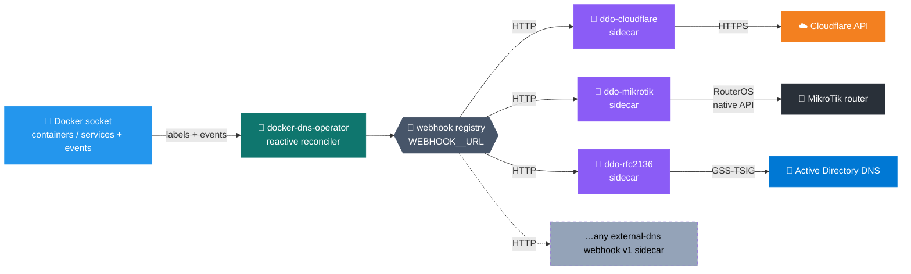

# 🧭 docker-dns-operator

> 🐳 Declarative DNS for Docker. The Docker analog of [kubernetes-sigs/external-dns](https://github.com/kubernetes-sigs/external-dns): label your containers (standalone Docker) or services (Swarm) with the desired DNS records and the operator reconciles them into Cloudflare, MikroTik RouterOS, and/or Active Directory DNS — reactively, as containers come and go.

[](https://github.com/mrkhachaturov/docker-dns-operator/pkgs/container/docker-dns-operator)
[](LICENSE)

|     | Scope           | Meaning                                                                                                                                                                      |
| --- | --------------- | ---------------------------------------------------------------------------------------------------------------------------------------------------------------------------- |
| 🐳  | Runs on         | Standalone Docker and Docker Swarm — auto-detected at startup                                                                                                                |
| 🏷️  | Source of truth | Container labels, or Swarm `deploy.labels`                                                                                                                                   |
| 🔄  | Reconciler      | Event-driven: subscribes to Docker container/service events and reconciles on change. Slow fallback every `EXECUTION_FREQUENCY_SECONDS` as a safety net + DDNS-IP propagator |
| 🌐  | Providers       | Cloudflare, MikroTik RouterOS, RFC 2136 / Active Directory                                                                                                                   |
| 🛡️  | Ownership       | Per-sidecar marker carrying `${PROJECT_LABEL}:${INSTANCE_ID}`. Pre-existing records are never touched                                                                        |
| 🧩  | Records         | A, AAAA, CNAME, MX, NS (all providers)                                                                                                                                       |

> [!TIP]
> Two instances with different `INSTANCE_ID`s can manage the same zone without conflicting. Each instance only sees and modifies records carrying its own ownership marker.

---

## 📚 Contents

- [🗺️ Architecture](#️-architecture)
- [⚡ Quick start](#-quick-start)
- [🌐 Providers](#-providers)
  - [📜 Sidecar contract checklist](#-sidecar-contract-checklist)
- [⚙️ Configuration](#️-configuration)
- [📦 Examples](#-examples)
- [🛠️ Operations](#️-operations)
- [🔐 Security](#-security)
- [🧪 Development](#-development)
- [🙏 Credits](#-credits)
- [📜 License](#-license)

---

## 🗺️ Architecture



On each reconcile pass (triggered by a Docker event or the fallback timer):

1. 📥 Lists Docker containers, or Swarm services when running on a manager node.
2. 🏷️ Parses the `${PROJECT_LABEL}:${INSTANCE_ID}` label as a JSON array of entries.
3. 🔀 Groups entries by their `providers` field.
4. ⚖️ For each provider, diffs desired state against owned records and applies create/update/delete.

The operator subscribes to the Docker daemon's event stream and reacts within `RECONCILE_DEBOUNCE_MS` (default 500 ms) of any `container create/start/stop/die/destroy` — plus `service create/update/remove` on Swarm managers. `EXECUTION_FREQUENCY_SECONDS` (default 60) is the fallback timer that re-runs the sweep in case events were missed, and the only thing that propagates DDNS public-IP changes (no Docker event fires for those).

Standalone Docker vs Swarm mode is **auto-detected at startup** via `docker info`. On a Swarm manager the operator switches to `listServices` and reads labels from `deploy.labels`. On a worker or non-swarm host it falls back to local containers. To manage labels across the whole cluster from a single operator instance, run it on a manager node.

> [!IMPORTANT]
> Every managed record is stamped with the operator's identity `${PROJECT_LABEL}:${INSTANCE_ID}` so the reconciler only ever touches its own records. The mechanism differs per sidecar to match the backend's native facilities:
>
> - **Cloudflare** and **MikroTik** — written into the record's `comment` field.
> - **RFC 2136 / AD** — paired TXT record at `ddo-<type>.<name>` with value `owned-by=${PROJECT_LABEL}:${INSTANCE_ID}` (the external-dns convention for raw DNS).
>
> In all three cases the operator sees only rows carrying its own marker; everything else stays untouched. Two instances with different `INSTANCE_ID`s coexist safely in the same zone.

---

## ⚡ Quick start

Minimum Cloudflare setup using the [ddo-cloudflare](https://github.com/mrkhachaturov/ddo-cloudflare) sidecar. Drop this into a `docker-compose.yml`, supply a token, run `docker compose up -d`:

```yaml
services:
  ddo-cloudflare:
    image: ghcr.io/mrkhachaturov/ddo-cloudflare:0.1.1
    environment:
      CLOUDFLARE_API_TOKEN_FILE: /run/secrets/cloudflare_token
    secrets:
      - cloudflare_token

  dns-operator:
    image: ghcr.io/mrkhachaturov/docker-dns-operator:0.1.3
    environment:
      WEBHOOK_CF_URL: http://ddo-cloudflare:9090
    volumes:
      - /var/run/docker.sock:/var/run/docker.sock:ro
    restart: unless-stopped

  whoami:
    image: traefik/whoami
    labels:
      docker-dns-operator:1: |
        [{ "type": "A", "name": "whoami.example.com", "address": "192.0.2.10" }]

secrets:
  cloudflare_token:
    file: ./cloudflare_token.txt
```

The operator subscribes to Docker container events (`create/start/stop/die/destroy`) and reconciles within ~500 ms of any change — so `whoami.example.com` appears in Cloudflare almost as soon as the container is up, and disappears when you remove it. A slow safety-net timer (`EXECUTION_FREQUENCY_SECONDS`, default 60) re-runs the full sweep in case an event was missed.

> [!NOTE]
> Two things to fix before this actually deploys: replace `whoami.example.com` with a name in a zone your Cloudflare token can edit, and put a real public IP in `address`. The entry omits `providers`, which defaults to `["cf"]` — fine here, but route explicitly (`"providers": ["cf"]` or any other key you've registered) for anything beyond a single-provider demo.

For MikroTik or Active Directory, see [Providers](#-providers).

---

## 🌐 Providers

In docker-dns-operator every backend lives in its own **webhook sidecar** container. The operator itself has no in-process DNS implementation — it discovers any number of named sidecars from `WEBHOOK_<NAME>_URL` env vars and routes records to them by name. Three reference sidecars live under [sidecars/](sidecars/) as git submodules; adding a new backend means publishing a sidecar repo and pointing the operator at it via one more env var (no operator code changes).

The wire format between operator and sidecar is the [kubernetes-sigs/external-dns webhook provider v1 contract](https://kubernetes-sigs.github.io/external-dns/latest/docs/tutorials/webhook-provider/) — a deliberate choice so the same sidecar serves docker-dns-operator and the upstream external-dns controller interchangeably. This project owns the operator side (Docker label parsing, reconciliation, fan-out routing); the sidecars own the protocol layer to each DNS backend.

### ☁️ Cloudflare (via webhook sidecar)

Enabled by running the [ddo-cloudflare](https://github.com/mrkhachaturov/ddo-cloudflare) sidecar alongside the operator and pointing `WEBHOOK_CF_URL` at it. The sidecar owns the Cloudflare API token, the zone allow-list, and the proxy default — see its [README](https://github.com/mrkhachaturov/ddo-cloudflare#how-to-configure) for the full env list.

Supports A, AAAA, CNAME, MX, NS, with optional proxying via `providerOptions.cf.proxy` (round-tripped to the sidecar through the standard external-dns providerSpecific property).

The multi-account use case is the main reason this is a sidecar now — run a container per Cloudflare account, each with its own token, route records via `providers: ["cf-personal"]` vs `providers: ["cf-work"]`.

### 📡 MikroTik RouterOS (via webhook sidecar)

Enabled when `WEBHOOK_MIKROTIK_URL` is set on the operator and the [ddo-mikrotik](https://github.com/mrkhachaturov/ddo-mikrotik) sidecar is reachable at that URL. The sidecar talks the **native RouterOS binary API** (port 8728 cleartext / 8729 api-ssl), not REST — see the sidecar's README for the full env var list and the dedicated RouterOS user setup.

Supports A, AAAA, CNAME, MX, NS.

The sidecar lives in its own repo at [mrkhachaturov/ddo-mikrotik](https://github.com/mrkhachaturov/ddo-mikrotik) and is attached here as a git submodule under [sidecars/ddo-mikrotik/](sidecars/ddo-mikrotik/). Ownership is round-tripped through the row's `comment` field: the operator stamps `labels.owner` on every Endpoint, the sidecar persists it verbatim and reads it back on the next list — so two operators with different `INSTANCE_ID`s can safely share the same router.

### 🏢 RFC 2136 / Active Directory (via webhook sidecar)

Enabled when `WEBHOOK_RFC2136_URL` is set on the operator and the [ddo-rfc2136](https://github.com/mrkhachaturov/ddo-rfc2136) webhook sidecar is reachable at that URL. Uses the same RFC 2136 provider model as [external-dns](https://github.com/kubernetes-sigs/external-dns/blob/master/docs/tutorials/rfc2136.md), with GSS-TSIG for Active Directory. All RFC 2136 configuration (DC hosts, zones, Kerberos realm/principal, keytab, TTLs, AXFR toggle, dry-run) lives on the sidecar — see its [README](https://github.com/mrkhachaturov/ddo-rfc2136#configuration) for the full env list.

Supports A, AAAA, CNAME, MX, NS.


The Kerberos/TSIG protocol layer runs in a separate Go webhook sidecar that lives in its own repo at [mrkhachaturov/ddo-rfc2136](https://github.com/mrkhachaturov/ddo-rfc2136) and is attached here as a git submodule under [sidecars/ddo-rfc2136/](sidecars/ddo-rfc2136/). The sidecar acquires Kerberos credentials on startup (either `kinit -kt` against a keytab or password mode), refreshes the TGT in the background, signs UPDATE and AXFR with GSS-TSIG, and exposes `/healthz`.

The **sidecar** implements failover across multiple DCs (`RFC2136_HOSTS` env on the sidecar) with a per-DC circuit breaker, per-zone DC pinning, and an AXFR-disabled mode for environments where zone transfers are denied — see the sidecar README for the full list. Ownership is round-tripped through the standard external-dns paired TXT marker (`ddo-<type>.<name>`), surfaced verbatim on `GET /records` and respected on `POST /records`.

> [!CAUTION]
> `RFC2136_HOSTS` (on the sidecar) must contain real DNS hostnames of your DCs. IPs and bare hostnames are rejected at startup. AD's Kerberos service principal is bound to the host you contact; an IP or short name produces `KDC_ERR_S_PRINCIPAL_UNKNOWN` or `KDC_ERR_WRONG_REALM` on every cycle.

> [!CAUTION]
> The **Kerberos realm** portion of a principal is case-sensitive and must match what your KDC issues — uppercase by convention (`AD.EXAMPLE.ORG`, not `ad.example.org`). Three places this bites: the `[realms]` / `[domain_realm]` keys in `krb5.conf`, the service-account principal you pass to the sidecar (`svc@AD.EXAMPLE.ORG`), and the keytab itself (`ktpass.exe` bakes the realm verbatim — regenerate if the case is wrong). Verify with `klist -k /path/to/keytab`. The DNS zone case is independent and follows DNS rules (case-insensitive).

See [docs/rfc2136-integration-runbook.md](docs/rfc2136-integration-runbook.md) for keytab generation, AD permission setup, and the full deployment walkthrough.

### 🔌 Generic webhook sidecars

Any sidecar implementing the [kubernetes-sigs/external-dns webhook provider contract v1](https://kubernetes-sigs.github.io/external-dns/latest/docs/tutorials/webhook-provider/) plugs straight into the operator without code changes here. Each instance is declared by a single env var on the operator:

```bash
WEBHOOK_<NAME>_URL=http://sidecar:9090
```

`<NAME>` becomes the provider key (lowercased; underscores → hyphens) and is what records reference in their `providers: [...]` label. The operator knows nothing else about the sidecar — credentials, zones, and backend protocol all live inside the sidecar's own container.

| Env var                       | Provider key      |
| ----------------------------- | ----------------- |
| `WEBHOOK_CF_URL`              | `cf`              |
| `WEBHOOK_MIKROTIK_HOME_URL`   | `mikrotik-home`   |
| `WEBHOOK_MIKROTIK_OFFICE_URL` | `mikrotik-office` |
| `WEBHOOK_RFC2136_CORP_URL`    | `rfc2136-corp`    |

This is the mechanism for declaring **multiple instances of the same backend** — e.g. a home MikroTik and an office MikroTik, with a single label routing one record to both:

```jsonc
[
  {
    "type": "A",
    "name": "shared.example.com",
    "address": "10.0.0.5",
    "providers": ["mikrotik-home", "mikrotik-office"],
  },
]
```

A typo in `providers: [...]` (e.g. `mikrotic-home`) causes that entry to fail reconciliation loudly — the operator never guesses what the user meant.

> [!NOTE]
> Every provider — Cloudflare ([ddo-cloudflare](https://github.com/mrkhachaturov/ddo-cloudflare)), MikroTik ([ddo-mikrotik](https://github.com/mrkhachaturov/ddo-mikrotik)), and RFC 2136 ([ddo-rfc2136](https://github.com/mrkhachaturov/ddo-rfc2136)) — is now a sidecar registered via `WEBHOOK_<NAME>_URL`. The operator no longer carries any in-process DNS implementation.

**Naming rules** (enforced by [src/webhook-provider/registry.ts](src/webhook-provider/registry.ts) at startup):

- Var name must match `WEBHOOK_<NAME>_URL` with `<NAME>` non-empty alphanumeric + underscore.
- `<NAME>` is lowercased and `_` → `-` to form the provider key. So `WEBHOOK_CF_PERSONAL_URL` → key `cf-personal`.
- The bare name `WEBHOOK_URL` is rejected — `<NAME>` is required.
- Value must be a non-empty, parseable URL.
- If two env vars normalize to the same provider key (e.g. `WEBHOOK_CF_HOME_URL` + `WEBHOOK_CF-HOME_URL`), the operator refuses to start.

See [Configuration » `WEBHOOK_TIMEOUT_SECONDS`](#️-environment-variables) for the per-call HTTP timeout that applies to every webhook instance.

### 📜 Sidecar contract checklist

To plug a 4th backend in without touching operator code, your sidecar needs:

1. **External-dns webhook v1 endpoints** — the operator calls:
   - `GET /` — capability negotiation. Return `application/external.dns.webhook+json;version=1` with the sidecar's `DomainFilter` — the zones you actually serve — as `{"include": ["zone1.example.com", "zone2.example.com"]}`. The operator caches this at startup and pre-filters records by zone before the apply pass, so an entry whose name falls outside any registered sidecar's zones is dropped at the operator with a named WARN instead of round-tripping a sidecar 4xx. **Do not emit the legacy `{"filters": [...]}` shape** — upstream external-dns parses that as "no filter, accept everything", which defeats the whole point.
   - `GET /records` — current set of records the sidecar is responsible for. The operator filters by ownership (`labels.owner`) on its side, but you SHOULD honour `labels.owner` round-trips on every record (see #3).
   - `POST /records` — apply a `Changes` payload (`Create`/`UpdateOld`/`UpdateNew`/`Delete`).
   - Optionally `POST /adjustendpoints` — leave it as identity if you have nothing to normalize.
2. **`/healthz`** — return `200` when your sidecar is ready to take writes. The operator does NOT probe this at startup, but Docker/Swarm HEALTHCHECK and humans both rely on it. Mirror the three reference sidecars and bind on port `9090`.
3. **Ownership round-trip** — every record the operator sends carries `labels.owner = "${PROJECT_LABEL}:${INSTANCE_ID}"`. Persist that label on the backend's native facility (a `comment` field, a paired TXT marker, a custom attribute — whatever your backend has) and return it verbatim on `GET /records`. This is how two operators with different `INSTANCE_ID`s safely share one DNS zone — and it must NOT be derived from your sidecar's own env. See [docs/sidecar-architecture.md](docs/sidecar-architecture.md) for the full ownership contract.
4. **Crash-safe failures** — `/records` and `/healthz` should never hang. The operator bounds you at `WEBHOOK_TIMEOUT_SECONDS` (default 15s) per call; past that it logs the timeout and moves on.

Once those are in place: publish the image, declare `WEBHOOK_MYBACKEND_URL=http://mybackend:9090` on the operator, route records with `"providers": ["mybackend"]`. The operator never needs to know what's on the other end of the URL.

---

## ⚙️ Configuration

### 🌍 Environment variables

<details>
<summary><strong>🧭 Common (always applicable)</strong></summary>

Validation is enforced at startup by [src/app.configuration.ts](src/app.configuration.ts) (Joi). Invalid values fail boot loudly with the exact field and constraint.

| Variable                           | Default               | Constraint        | Description                                                                                                                                                                                                                                                                         |
| ---------------------------------- | --------------------- | ----------------- | ----------------------------------------------------------------------------------------------------------------------------------------------------------------------------------------------------------------------------------------------------------------------------------- |
| `PROJECT_LABEL`                    | `docker-dns-operator` | `[A-Za-z0-9-_.]+` | First half of the Docker label key, and the ownership marker for managed records.                                                                                                                                                                                                   |
| `INSTANCE_ID`                      | `1`                   | `[A-Za-z0-9-_]+`  | Second half of the label key. Combined as `${PROJECT_LABEL}:${INSTANCE_ID}`.                                                                                                                                                                                                        |
| `EXECUTION_FREQUENCY_SECONDS`      | `60`                  | integer ≥ 1       | Fallback reconcile interval. Docker events drive the primary trigger; this is the safety net for missed events and the only mechanism that propagates DDNS public-IP changes.                                                                                                       |
| `RECONCILE_DEBOUNCE_MS`            | `500`                 | integer 50–10000  | Coalesces bursts of Docker events (e.g. a stack deploy creating 10 services at once) into a single reconcile pass.                                                                                                                                                                  |
| `DDNS_EXECUTION_FREQUENCY_MINUTES` | `60`                  | integer ≥ 1       | Public IP check interval. Only active when an entry uses `"address": "DDNS"`.                                                                                                                                                                                                       |
| `PRESERVE_STOPPED`                 | `false`               | boolean           | If `true`, stopped containers (standalone) or services with `RunningTasks=0` (Swarm) keep their DNS entries. Removed containers / removed services always lose them.                                                                                                                |
| `WEBHOOK_TIMEOUT_SECONDS`          | `15`                  | integer ≥ 1       | Per-request HTTP timeout applied to every operator → sidecar webhook call. Bounds how long any one provider can hang a reconcile pass.                                                                                                                                              |
| `HEALTH_PORT`                      | `9090`                | integer 1–65535   | Port for the `GET /healthz` liveness endpoint. Same default as the sidecars. If you override this, also adjust the `wget --spider` URL in any compose-level `healthcheck:` block — those hardcode `9090`.                                                                           |
| `LOG_LEVEL`                        | `log`                 | enum              | One of `fatal`, `error`, `warn`, `log`, `debug`, `verbose` (`info` is accepted as an alias for `log`). Defaults to `log` to match external-dns (whose default is `info`): startup, per-record `Desired change` lines, and the per-provider sync summary are visible out of the box. |

At least one `WEBHOOK_<NAME>_URL` env var must be set, or `ProviderRegistry.initialize()` throws `No providers configured` at startup. See [Generic webhook sidecars](#-generic-webhook-sidecars) for naming rules.

</details>

<details>
<summary><strong>☁️ Cloudflare</strong></summary>

Cloudflare is now provided by the [ddo-cloudflare](https://github.com/mrkhachaturov/ddo-cloudflare) sidecar. The operator side has a single env var:

| Variable         | Default | Description                                                                                                       |
| ---------------- | ------- | ----------------------------------------------------------------------------------------------------------------- |
| `WEBHOOK_CF_URL` |         | URL of a ddo-cloudflare sidecar, e.g. `http://ddo-cloudflare:9090`. The `CF` token becomes the provider key `cf`. |

For multiple Cloudflare accounts, run multiple sidecars and declare multiple env vars (`WEBHOOK_CF_PERSONAL_URL`, `WEBHOOK_CF_WORK_URL`, …). Each sidecar's own env (API token, zones, proxy default) lives on its container — see the sidecar README.

</details>

<details>
<summary><strong>📡 MikroTik — operator-side env</strong></summary>

The operator's only MikroTik-related variable is the URL of the sidecar. All RouterOS configuration (address, credentials, TLS, default TTL, zones) lives on the [ddo-mikrotik](https://github.com/mrkhachaturov/ddo-mikrotik) sidecar's environment — see its README for the full list.

| Variable               | Default | Description                                                                                                                                                                     |
| ---------------------- | ------- | ------------------------------------------------------------------------------------------------------------------------------------------------------------------------------- |
| `WEBHOOK_MIKROTIK_URL` |         | URL of the `ddo-mikrotik` webhook sidecar, e.g. `http://ddo-mikrotik:9090`. The operator does not probe sidecars at startup — failures surface during reconcile and are logged. |

</details>

<details>
<summary><strong>🏢 RFC 2136 — operator-side env</strong></summary>

The operator's only RFC 2136-related variable is the URL of the sidecar. All RFC 2136 configuration (DC hosts, zones, Kerberos realm/principal, keytab, TTLs, AXFR toggle, dry-run, circuit-breaker thresholds, domain filter) lives on the [ddo-rfc2136](https://github.com/mrkhachaturov/ddo-rfc2136) sidecar's environment — see its [README](https://github.com/mrkhachaturov/ddo-rfc2136#configuration) for the full list.

| Variable              | Default | Description                                                                                                                                                                   |
| --------------------- | ------- | ----------------------------------------------------------------------------------------------------------------------------------------------------------------------------- |
| `WEBHOOK_RFC2136_URL` |         | URL of the `ddo-rfc2136` webhook sidecar, e.g. `http://ddo-rfc2136:9090`. The operator does not probe sidecars at startup — failures surface during reconcile and are logged. |

</details>

**Sidecar env (set on the `ddo-rfc2136` container):** documented in the [sidecar repo README](https://github.com/mrkhachaturov/ddo-rfc2136#configuration). Each webhook sidecar owns its own configuration docs, matching the [external-dns webhook-provider model](https://github.com/kubernetes-sigs/external-dns/blob/master/docs/tutorials/webhook-provider.md). The operator never reads the keytab and never obtains Kerberos tickets — that all happens inside the sidecar.

### 🏷️ Label schema

A single Docker label whose **key** is `${PROJECT_LABEL}:${INSTANCE_ID}` and whose **value** is a JSON-stringified array of entry objects.

```yaml
labels:
  docker-dns-operator:1: |
    [
      {
        "type": "A",
        "name": "app.example.com",
        "address": "192.0.2.10",
        "providers": ["cf", "mikrotik"],
        "providerOptions": {
          "cf": { "proxy": true }
        }
      }
    ]
```

| Field             | Type            | Description                                                                                                            |
| ----------------- | --------------- | ---------------------------------------------------------------------------------------------------------------------- |
| `type`            | string          | One of `A`, `AAAA`, `CNAME`, `MX`, `NS`.                                                                               |
| `name`            | string          | Fully-qualified record name.                                                                                           |
| `providers`       | string \| array | `["cf"]`, `["mikrotik"]`, `["rfc2136"]`, any combination, or the shorthand `"all"`. Defaults to `["cf"]` when omitted. |
| `provider`        | string          | Legacy singular form. Accepted and normalized to `providers`.                                                          |
| `providerOptions` | object          | Per-provider options, keyed by provider id.                                                                            |

`providerOptions.cf.proxy` (boolean) toggles Cloudflare proxying for A/CNAME — the only `providerOptions` field the operator currently round-trips to a sidecar (see `src/docker/label-normalizer.ts`). The legacy top-level `proxy` field is still accepted for Cloudflare entries. TTL overrides happen on the sidecar side via its own env vars; per-entry TTL via the label isn't wired yet.

### 🧩 Record types

|     | Type    | Required fields      | Notes                                                                                    |
| --- | ------- | -------------------- | ---------------------------------------------------------------------------------------- |
| 🅰️  | `A`     | `address`            | Address can be the literal `"DDNS"` to use the host's public IPv4.                       |
| 6️⃣  | `AAAA`  | `address`            | IPv6 literal. Supported by all three reference sidecars (Cloudflare, MikroTik, rfc2136). |
| 🔗  | `CNAME` | `target`             | Target should resolve via an existing A or CNAME.                                        |
| ✉️  | `MX`    | `server`, `priority` | Priority is an integer 0–65535.                                                          |
| 🧭  | `NS`    | `server`             | Delegates a (sub)domain to another nameserver.                                           |

---

## 📦 Examples

### 🔐 Token in a file (recommended for Cloudflare)

```yaml
services:
  ddo-cloudflare:
    image: ghcr.io/mrkhachaturov/ddo-cloudflare:0.1.1
    environment:
      CLOUDFLARE_API_TOKEN_FILE: /run/secrets/cloudflare_token
    secrets:
      - cloudflare_token

  dns-operator:
    image: ghcr.io/mrkhachaturov/docker-dns-operator:0.1.3
    environment:
      WEBHOOK_CF_URL: http://ddo-cloudflare:9090
    volumes:
      - /var/run/docker.sock:/var/run/docker.sock:ro

  whoami:
    image: traefik/whoami
    labels:
      docker-dns-operator:1: |
        [{ "type": "A", "name": "whoami.example.com", "address": "192.0.2.10" }]

secrets:
  cloudflare_token:
    file: ./cloudflare_token.txt
```

<details>
<summary>🔀 <strong>Split routing — public to Cloudflare, internal to MikroTik</strong></summary>

```yaml
services:
  ddo-cloudflare:
    image: ghcr.io/mrkhachaturov/ddo-cloudflare:0.1.1
    environment:
      CLOUDFLARE_API_TOKEN_FILE: /run/secrets/cloudflare_token
    secrets:
      - cloudflare_token

  dns-operator:
    image: ghcr.io/mrkhachaturov/docker-dns-operator:0.1.3
    environment:
      WEBHOOK_CF_URL: http://ddo-cloudflare:9090
      WEBHOOK_MIKROTIK_URL: http://ddo-mikrotik:9090
    volumes:
      - /var/run/docker.sock:/var/run/docker.sock:ro

  ddo-mikrotik:
    image: ghcr.io/mrkhachaturov/ddo-mikrotik:0.1.1
    environment:
      MIKROTIK_ADDRESS: 192.168.1.1:8728
      MIKROTIK_USERNAME_FILE: /run/secrets/mikrotik_user
      MIKROTIK_PASSWORD_FILE: /run/secrets/mikrotik_pass
    secrets:
      - mikrotik_user
      - mikrotik_pass

  app:
    image: nginx
    labels:
      docker-dns-operator:1: |
        [
          { "type": "A", "name": "app.example.com", "address": "192.0.2.10",
            "providers": ["cf"], "providerOptions": { "cf": { "proxy": true } } },
          { "type": "A", "name": "app.lan", "address": "192.168.1.50",
            "providers": ["mikrotik"] }
        ]
```

</details>

<details>
<summary>☁️ <strong>Multiple Cloudflare accounts</strong></summary>

Run one ddo-cloudflare container per account, declare one env var per container, and route records with the matching provider key:

```yaml
services:
  ddo-cloudflare-personal:
    image: ghcr.io/mrkhachaturov/ddo-cloudflare:0.1.1
    environment:
      CLOUDFLARE_API_TOKEN_FILE: /run/secrets/cf_personal
    secrets: [cf_personal]

  ddo-cloudflare-work:
    image: ghcr.io/mrkhachaturov/ddo-cloudflare:0.1.1
    environment:
      CLOUDFLARE_API_TOKEN_FILE: /run/secrets/cf_work
    secrets: [cf_work]

  dns-operator:
    image: ghcr.io/mrkhachaturov/docker-dns-operator:0.1.3
    environment:
      WEBHOOK_CF_PERSONAL_URL: http://ddo-cloudflare-personal:9090
      WEBHOOK_CF_WORK_URL: http://ddo-cloudflare-work:9090
    volumes:
      - /var/run/docker.sock:/var/run/docker.sock:ro

  app:
    image: nginx
    labels:
      docker-dns-operator:1: |
        [
          { "type": "A", "name": "blog.personal.example.com",  "address": "192.0.2.10", "providers": ["cf-personal"] },
          { "type": "A", "name": "app.work.example.org", "address": "192.0.2.10", "providers": ["cf-work"] }
        ]

secrets:
  cf_personal: { file: ./cf_personal.txt }
  cf_work: { file: ./cf_work.txt }
```

</details>

### 🌐 DDNS — public IPv4 of the host

```yaml
labels:
  docker-dns-operator:1: |
    [{ "type": "A", "name": "home.example.com", "address": "DDNS" }]
```

The operator starts the DDNS service when any entry uses `"DDNS"`, queries the current public IPv4 every `DDNS_EXECUTION_FREQUENCY_MINUTES`, and updates the record when the IP changes.

<details>
<summary>🔢 <strong>Two domains, two operator instances</strong></summary>

Independent operator instances, each pointing at its own Cloudflare sidecar:

```yaml
services:
  ddo-cloudflare-a:
    image: ghcr.io/mrkhachaturov/ddo-cloudflare:0.1.1
    environment:
      CLOUDFLARE_API_TOKEN_FILE: /run/secrets/token_a
    secrets: [token_a]

  ddo-cloudflare-b:
    image: ghcr.io/mrkhachaturov/ddo-cloudflare:0.1.1
    environment:
      CLOUDFLARE_API_TOKEN_FILE: /run/secrets/token_b
    secrets: [token_b]

  dns-a:
    image: ghcr.io/mrkhachaturov/docker-dns-operator:0.1.3
    environment:
      INSTANCE_ID: a
      WEBHOOK_CF_URL: http://ddo-cloudflare-a:9090
    volumes:
      - /var/run/docker.sock:/var/run/docker.sock:ro

  dns-b:
    image: ghcr.io/mrkhachaturov/docker-dns-operator:0.1.3
    environment:
      INSTANCE_ID: b
      WEBHOOK_CF_URL: http://ddo-cloudflare-b:9090
    volumes:
      - /var/run/docker.sock:/var/run/docker.sock:ro

  app:
    image: nginx
    labels:
      docker-dns-operator:a: '[{ "type": "A", "name": "a.example.com", "address": "192.0.2.10" }]'
      docker-dns-operator:b: '[{ "type": "A", "name": "b.example.org", "address": "198.51.100.20" }]'
```

</details>

<details>
<summary>🏢 <strong>Active Directory (RFC 2136)</strong></summary>

The operator carries only the sidecar URL. All RFC 2136 configuration (DC hosts, zones, Kerberos realm/principal, keytab) lives on the sidecar:

```yaml
services:
  dns-operator:
    image: ghcr.io/mrkhachaturov/docker-dns-operator:0.1.3
    environment:
      WEBHOOK_RFC2136_URL: 'http://ddo-rfc2136:9090'
    volumes:
      - /var/run/docker.sock:/var/run/docker.sock:ro

  ddo-rfc2136:
    image: ghcr.io/mrkhachaturov/ddo-rfc2136:0.1.1
    environment:
      RFC2136_HOSTS: 'dc01.corp.example.com,dc02.corp.example.com'
      RFC2136_ZONES: 'corp.example.com'
      RFC2136_KERBEROS_REALM: 'CORP.EXAMPLE.COM'
      RFC2136_KERBEROS_PRINCIPAL: 'svc-dns@CORP.EXAMPLE.COM'
      # Pick exactly one auth mode:
      RFC2136_AD_PASSWORD_FILE: '/run/secrets/rfc2136_password'
      # or:
      # RFC2136_KEYTAB_FILE: "/run/secrets/rfc2136_keytab"
    secrets:
      - rfc2136_password

  app:
    image: nginx
    labels:
      docker-dns-operator:1: |
        [{ "type": "A", "name": "app.corp.example.com", "address": "10.20.30.40",
           "providers": ["rfc2136"] }]

secrets:
  rfc2136_password:
    file: ./rfc2136_password.txt
```

See [docs/rfc2136-integration-runbook.md](docs/rfc2136-integration-runbook.md) for the full setup.

</details>

<details>
<summary>🐝 <strong>Docker Swarm</strong></summary>

Labels must live under `deploy.labels`, not the top-level `labels` key:

```yaml
services:
  ddo-cloudflare:
    image: ghcr.io/mrkhachaturov/ddo-cloudflare:0.1.1
    environment:
      CLOUDFLARE_API_TOKEN_FILE: /run/secrets/cloudflare_token
    secrets: [cloudflare_token]
    deploy:
      placement:
        constraints: [node.role == manager]

  dns-operator:
    image: ghcr.io/mrkhachaturov/docker-dns-operator:0.1.3
    environment:
      WEBHOOK_CF_URL: http://ddo-cloudflare:9090
    volumes:
      - /var/run/docker.sock:/var/run/docker.sock:ro
    deploy:
      placement:
        constraints: [node.role == manager]

  app:
    image: nginx
    deploy:
      labels:
        docker-dns-operator:1: '[{ "type": "A", "name": "app.example.com", "address": "192.0.2.10" }]'
```

`PRESERVE_STOPPED` in Swarm mode keeps DNS for services whose `ServiceStatus.RunningTasks` is `0` (scaled-down, crash-looping, or otherwise unhealthy) as long as the service still exists. Removing the service (`docker service rm` / `docker stack rm`) always drops the records. The operator must run on a manager node so it can list services.

</details>

---

## 🛠️ Operations

### 📝 Logging

`LOG_LEVEL` maps to the NestJS logger. Order from most-specific to least: `fatal` → `error` → `warn` → `log` → `debug` → `verbose`. Each level includes everything above. The default is `log`, mirroring external-dns's `info` default — at this level a deploy that changes records emits one `Desired change: <ACTION> <type>:<name>` line per record plus a per-provider `Synchronisation complete: …` summary, and label-validation drops surface as `warn`. Idle/no-op ticks stay silent unless you raise to `debug`. Quieter production deployments can drop to `warn` or `error`; note that at `error` even reconcile failures and rejected labels are hidden. Invalid values are rejected at startup with a clear validation error.

### 🩺 Health

Every container exposes `GET /healthz` on port `9090` (operator override via `HEALTH_PORT`). All four ship a Dockerfile `HEALTHCHECK` that probes it — visible in `docker ps` / `docker service ps` and used by Swarm to reschedule a stuck task.

| Container                         | Healthy means                                                                            | Unhealthy means                                                                        |
| --------------------------------- | ---------------------------------------------------------------------------------------- | -------------------------------------------------------------------------------------- |
| Operator                          | HTTP server is up and the event loop is responding (probe returns `200 {"status":"ok"}`) | Probe times out or the process is not responding — orchestrator restarts the container |
| `ddo-cloudflare` / `ddo-mikrotik` | Sidecar process is reachable                                                             | Process not responding                                                                 |
| `ddo-rfc2136`                     | Kerberos TGT is alive and refreshable                                                    | TGT could not be refreshed                                                             |

The operator's `/healthz` is pure **liveness** and never returns 503 of its own accord — provider/sidecar outages do NOT flip it, because killing the operator wouldn't fix a downstream API. Per-provider failures surface through the reconciliation error log instead; each sidecar carries its own healthcheck for its own state.

> [!NOTE]
> If you override `HEALTH_PORT`, also adjust any compose-level `healthcheck:` block — `docker-stack.yml` and `docker-compose.yml` hardcode `http://127.0.0.1:9090/healthz`. The image-baked Dockerfile `HEALTHCHECK` already honours `${HEALTH_PORT:-9090}` and needs no change.

### ⚠️ Failure modes worth knowing

- 🔌 **No `WEBHOOK_<NAME>_URL` set** → operator fails to boot with `ProviderRegistry: No providers configured. Declare at least one WEBHOOK_<NAME>_URL sidecar.` Set at least one before the operator can start.
- 🪪 **Entry references an unknown provider key** (e.g. `providers: ["mikrotic"]` typo) → that entry is rejected loudly with a per-entry ERROR log listing the configured provider keys; other entries reconcile normally. No silent fallback or "best guess".
- 🐌 **Hung sidecar** → bounded by `WEBHOOK_TIMEOUT_SECONDS` (default 15s). The reconcile pass logs the timeout and the next event/fallback retry tries again — the operator never gets stuck on one slow provider.
- 🔄 **Burst of events** → coalesced into one reconcile by `RECONCILE_DEBOUNCE_MS` (default 500ms). A `docker stack deploy` creating 10 services triggers one reconcile, not ten.

---

## 🔐 Security

|     | Concern           | Recommendation                                                                                                                                                                                              |
| --- | ----------------- | ----------------------------------------------------------------------------------------------------------------------------------------------------------------------------------------------------------- |
| 🔑  | Cloudflare tokens | Set `CLOUDFLARE_API_TOKEN_FILE` on the ddo-cloudflare sidecar with a Docker secret. Scope to `Zone.Zone:Read` + `Zone.DNS:Edit` on the specific zones only.                                                 |
| 📡  | MikroTik creds    | Least-privilege RouterOS user (`read+write+api` only). Lives on the ddo-mikrotik sidecar, not the operator. Console/SSH/Winbox/REST denied. See [examples/mikrotik/README.md](examples/mikrotik/README.md). |
| 🏢  | Keytab (rfc2136)  | Mount via Docker secret, never a world-readable bind mount. AD service account scoped to update only zones in `RFC2136_ZONES`.                                                                              |
| 🐳  | Docker socket     | Mount `:ro`. Consider [docker-socket-proxy](https://github.com/Tecnativa/docker-socket-proxy) in hostile multi-tenant environments.                                                                         |
| 🔓  | TLS               | `MIKROTIK_USE_TLS=true` + `MIKROTIK_SKIP_TLS_VERIFY=true` on the sidecar accepts a self-signed cert. Trusted networks only.                                                                                 |

> [!WARNING]
> Plain-env credentials (`CLOUDFLARE_API_TOKEN`, `MIKROTIK_PASSWORD`, etc.) leak via `docker inspect`, image layers, and container exec. Always prefer the `_FILE` variants + Docker secrets in production.

---

## 🧪 Development

Requirements: Node.js ≥ 22.11, Yarn 1.22.x (classic, not Berry).

```bash
yarn install
yarn start:dev          # 👀 watch mode
yarn build              # 🏗️ nest build → dist/

yarn lint               # 🧹 eslint --fix
yarn format             # 💅 prettier --write

yarn test               # 🧪 unit
yarn test:cov           # 📊 unit with coverage
yarn test:e2e           # 🐳 e2e (uses testcontainers, Docker required)
```

**Adding a new provider** is a sidecar story, not an operator-code story. Publish a container that speaks the [external-dns webhook provider v1 contract](https://kubernetes-sigs.github.io/external-dns/latest/docs/tutorials/webhook-provider/) (the same shape the upstream external-dns controller talks), point the operator at it via one `WEBHOOK_<NAME>_URL` env var, and route records with `providers: ["<name>"]` in the label. Zero changes here. See [Sidecar contract checklist](#-sidecar-contract-checklist) for the non-negotiables.

**Sidecar submodules.** Three reference sidecars live under [sidecars/](sidecars/) as git submodules — [ddo-cloudflare](https://github.com/mrkhachaturov/ddo-cloudflare), [ddo-mikrotik](https://github.com/mrkhachaturov/ddo-mikrotik), and [ddo-rfc2136](https://github.com/mrkhachaturov/ddo-rfc2136). After cloning, run `git submodule update --init --recursive` to fetch their source. To bump a pinned sidecar commit:

```bash
git -C sidecars/<name> checkout <ref>
git add sidecars/<name>
git commit -m "chore(sidecars): bump <name> to <ref>"
```

**Working on the operator itself.** TDD with unit specs next to the code (`*.spec.ts`); e2e specs that cross module boundaries live under `test/` and require Docker (`yarn test:e2e` uses testcontainers). Always `yarn lint && yarn test` before declaring done. Run `yarn test:e2e` if the change touches reconciliation, the Docker source, or webhook wiring.

Conventions and architecture notes for AI assistants are in [CLAUDE.md](CLAUDE.md).

---

## 🙏 Credits

Started as a fork of [timk153/docker-external-dns](https://github.com/timk153/docker-external-dns) and has since diverged substantially. Conceptual debt to [kubernetes-sigs/external-dns](https://github.com/kubernetes-sigs/external-dns) and [dntsk/extdns](https://github.com/dntsk/extdns). Built on [NestJS](https://github.com/nestjs/nest).

## 📜 License

[MIT](LICENSE).
