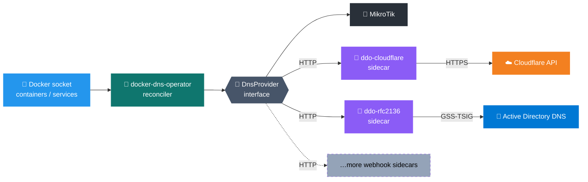

# 🧭 docker-dns-operator

> 🐳 Declarative DNS for Docker. The Docker analog of [kubernetes-sigs/external-dns](https://github.com/kubernetes-sigs/external-dns): label your containers (standalone Docker) or services (Swarm) with the desired DNS records and the operator reconciles them into Cloudflare, MikroTik RouterOS, and/or Active Directory DNS on every tick.

[](https://hub.docker.com/r/mrkhachaturov/docker-dns-operator)
[](LICENSE)

| | Scope | Meaning |
|---|---|---|
| 🐳 | Runs on | Standalone Docker and Docker Swarm — auto-detected at startup |
| 🏷️ | Source of truth | Container labels, or Swarm `deploy.labels` |
| 🔄 | Reconciler | Reads labels every `EXECUTION_FREQUENCY_SECONDS`, diffs, applies |
| 🌐 | Providers | Cloudflare, MikroTik RouterOS, RFC 2136 / Active Directory |
| 🛡️ | Ownership | TXT marker `ddo-<type>.<name>`. Pre-existing records are never touched |
| 🧩 | Records | A, AAAA (RFC 2136 only), CNAME, MX, NS |

> [!TIP]
> Two instances with different `INSTANCE_ID`s can manage the same zone without conflicting. Each instance only sees and modifies records carrying its own ownership marker.

---

## 📚 Contents

- [🗺️ Architecture](#️-architecture)
- [⚡ Quick start](#-quick-start)
- [🌐 Providers](#-providers)
- [⚙️ Configuration](#️-configuration)
- [📦 Examples](#-examples)
- [🛠️ Operations](#️-operations)
- [🔐 Security](#-security)
- [🧪 Development](#-development)
- [🙏 Credits](#-credits)
- [📜 License](#-license)

---

## 🗺️ Architecture



Each tick the reconciler:

1. 📥 Lists Docker containers, or Swarm services when running on a manager node.
2. 🏷️ Parses the `${PROJECT_LABEL}:${INSTANCE_ID}` label as a JSON array of entries.
3. 🔀 Groups entries by their `providers` field.
4. ⚖️ For each provider, diffs desired state against owned records and applies create/update/delete.

Standalone Docker vs Swarm mode is **auto-detected at startup** via `docker info`. On a Swarm manager the operator switches to `listServices` and reads labels from `deploy.labels`. On a worker or non-swarm host it falls back to local containers. To manage labels across the whole cluster from a single operator instance, run it on a manager node.

> [!IMPORTANT]
> Every managed record carries a sibling TXT record at `ddo-<type>.<name>` whose value is `owned-by=${PROJECT_LABEL}:${INSTANCE_ID}`. The reconciler refuses to modify any record without that marker.
>
> For an A record at `app.example.com` you'll see a paired `TXT ddo-a.app.example.com "owned-by=docker-dns-operator:1"` in the zone.

---

## ⚡ Quick start

Minimum Cloudflare setup using the [ddo-cloudflare](https://github.com/mrkhachaturov/ddo-cloudflare) sidecar. Drop this into a `docker-compose.yml`, supply a token, run `docker compose up -d`:

```yaml
services:
  ddo-cloudflare:
    image: mrkhachaturov/ddo-cloudflare:latest
    environment:
      CLOUDFLARE_API_TOKEN_FILE: /run/secrets/cloudflare_token
    secrets:
      - cloudflare_token

  dns-operator:
    image: mrkhachaturov/docker-dns-operator:latest
    environment:
      WEBHOOK_CF_URL: http://ddo-cloudflare:9090
    volumes:
      - /var/run/docker.sock:/var/run/docker.sock:ro
    restart: unless-stopped

  whoami:
    image: traefik/whoami
    labels:
      docker-dns-operator:1: |
        [{ "type": "A", "name": "whoami.example.com", "address": "1.2.3.4" }]

secrets:
  cloudflare_token:
    file: ./cloudflare_token.txt
```

The operator polls Docker every `EXECUTION_FREQUENCY_SECONDS` (default 60), reads the label off `whoami`, and creates `whoami.example.com` in Cloudflare. Remove the container, the record is removed on the next tick.

For MikroTik or Active Directory, see [Providers](#-providers).

---

## 🌐 Providers

The operator ships three providers today, all implementing the same `DnsProvider` interface. New ones plug in via one file — see [Development](#-development). Providers that need a protocol layer outside Node (Kerberos, signed updates, exotic transports) run as a **webhook sidecar** in their own container, addressed via `<PROVIDER>_WEBHOOK_URL` and shipped from a separate repo attached under [sidecars/](sidecars/) as a git submodule.

### ☁️ Cloudflare (via webhook sidecar)

Enabled by running the [ddo-cloudflare](https://github.com/mrkhachaturov/ddo-cloudflare) sidecar alongside the operator and pointing `WEBHOOK_CF_URL` at it. The sidecar owns the Cloudflare API token, the zone allow-list, and the proxy default — see its [README](https://github.com/mrkhachaturov/ddo-cloudflare#how-to-configure) for the full env list.

Supports A, AAAA, CNAME, MX, NS, with optional proxying via `providerOptions.cf.proxy` (round-tripped to the sidecar through the standard external-dns providerSpecific property).

The multi-account use case is the main reason this is a sidecar now — run a container per Cloudflare account, each with its own token, route records via `providers: ["cf-personal"]` vs `providers: ["cf-work"]`.

### 📡 MikroTik RouterOS (via webhook sidecar)

Enabled when `WEBHOOK_MIKROTIK_URL` is set on the operator and the [ddo-mikrotik](https://github.com/mrkhachaturov/ddo-mikrotik) sidecar is reachable at that URL. The sidecar talks the **native RouterOS binary API** (port 8728 cleartext / 8729 api-ssl), not REST — see the sidecar's README for the full env var list and the dedicated RouterOS user setup.

Supports A, AAAA, CNAME, MX, NS.

The sidecar lives in its own repo at [mrkhachaturov/ddo-mikrotik](https://github.com/mrkhachaturov/ddo-mikrotik) and is attached here as a git submodule under [sidecars/ddo-mikrotik/](sidecars/ddo-mikrotik/). Ownership is round-tripped through the row's `comment` field: the operator stamps `labels.owner` on every Endpoint, the sidecar persists it verbatim and reads it back on the next list — so two operators with different `INSTANCE_ID`s can safely share the same router.

### 🏢 RFC 2136 / Active Directory (via webhook sidecar)

Enabled when the required operator-side `RFC2136_*` variables are set and the [ddo-rfc2136](https://github.com/mrkhachaturov/ddo-rfc2136) webhook sidecar is reachable at `RFC2136_WEBHOOK_URL`. Uses the same RFC 2136 provider model as [external-dns](https://github.com/kubernetes-sigs/external-dns/blob/master/docs/tutorials/rfc2136.md), with GSS-TSIG for Active Directory.

Supports A, AAAA, CNAME, MX, NS.


The Kerberos/TSIG protocol layer runs in a separate Go webhook sidecar that lives in its own repo at [mrkhachaturov/ddo-rfc2136](https://github.com/mrkhachaturov/ddo-rfc2136) and is attached here as a git submodule under [sidecars/ddo-rfc2136/](sidecars/ddo-rfc2136/). The sidecar runs `kinit -kt` against a keytab on startup, refreshes the TGT every `RFC2136_KINIT_REFRESH_INTERVAL`, signs UPDATE and AXFR with GSS-TSIG, and exposes `/healthz` (HTTP 503 with `{"kerberos":"expired"}` on refresh failure).

The operator implements failover across multiple DCs (`RFC2136_HOSTS`) with a per-DC circuit breaker, per-zone DC pinning, and an AXFR-disabled mode (`RFC2136_AXFR_ENABLED=false`) for environments where zone transfers are denied.

> [!CAUTION]
> `RFC2136_HOSTS` must contain real DNS hostnames of your DCs. IPs and bare hostnames are rejected at startup. AD's Kerberos service principal is bound to the host you contact; an IP or short name produces `KDC_ERR_S_PRINCIPAL_UNKNOWN` or `KDC_ERR_WRONG_REALM` on every cycle.

See [docs/rfc2136-integration-runbook.md](docs/rfc2136-integration-runbook.md) for keytab generation, AD permission setup, and the full deployment walkthrough.

### 🔌 Generic webhook sidecars

Any sidecar implementing the [kubernetes-sigs/external-dns webhook provider contract v1](https://kubernetes-sigs.github.io/external-dns/latest/docs/tutorials/webhook-provider/) plugs straight into the operator without code changes here. Each instance is declared by a single env var on the operator:

```bash
WEBHOOK_<NAME>_URL=http://sidecar:9090
```

`<NAME>` becomes the provider key (lowercased; underscores → hyphens) and is what records reference in their `providers: [...]` label. The operator knows nothing else about the sidecar — credentials, zones, and backend protocol all live inside the sidecar's own container.

| Env var | Provider key |
|---|---|
| `WEBHOOK_CF_URL` | `cf` |
| `WEBHOOK_MIKROTIK_HOME_URL` | `mikrotik-home` |
| `WEBHOOK_MIKROTIK_OFFICE_URL` | `mikrotik-office` |
| `WEBHOOK_RFC2136_CORP_URL` | `rfc2136-corp` |

This is the mechanism for declaring **multiple instances of the same backend** — e.g. a home MikroTik and an office MikroTik, with a single label routing one record to both:

```jsonc
[
  { "type": "A", "name": "shared.example.com", "address": "10.0.0.5",
    "providers": ["mikrotik-home", "mikrotik-office"] }
]
```

A typo in `providers: [...]` (e.g. `mikrotic-home`) causes that entry to fail reconciliation loudly — the operator never guesses what the user meant.

> [!NOTE]
> Every provider — Cloudflare ([ddo-cloudflare](https://github.com/mrkhachaturov/ddo-cloudflare)), MikroTik ([ddo-mikrotik](https://github.com/mrkhachaturov/ddo-mikrotik)), and RFC 2136 ([ddo-rfc2136](https://github.com/mrkhachaturov/ddo-rfc2136)) — is now a sidecar registered via `WEBHOOK_<NAME>_URL`. The operator no longer carries any in-process DNS implementation.

| Env var | Default | Purpose |
|---|---|---|
| `WEBHOOK_TIMEOUT_SECONDS` | `15` | Per-request HTTP timeout applied to every webhook instance. |

---

## ⚙️ Configuration

### 🌍 Environment variables

<details>
<summary><strong>🧭 Common (always applicable)</strong></summary>

| Variable | Default | Description |
|---|---|---|
| `PROJECT_LABEL` | `docker-dns-operator` | First half of the Docker label key, and the ownership marker for managed records. |
| `INSTANCE_ID` | `1` | Second half of the label key. Combined as `${PROJECT_LABEL}:${INSTANCE_ID}`. |
| `EXECUTION_FREQUENCY_SECONDS` | `60` | Reconciliation interval. Integer ≥ 1. |
| `DDNS_EXECUTION_FREQUENCY_MINUTES` | `60` | Public IP check interval. Only active when an entry uses `"address": "DDNS"`. |
| `PRESERVE_STOPPED` | `false` | If `true`, stopped containers keep their DNS entries. Removed containers always lose them. Ignored on a Swarm manager. |
| `LOG_LEVEL` | `error` | One of `fatal`, `error`, `warn`, `log`, `debug`, `verbose`. |

</details>

<details>
<summary><strong>☁️ Cloudflare</strong></summary>

Cloudflare is now provided by the [ddo-cloudflare](https://github.com/mrkhachaturov/ddo-cloudflare) sidecar. The operator side has a single env var:

| Variable | Default | Description |
|---|---|---|
| `WEBHOOK_CF_URL` |  | URL of a ddo-cloudflare sidecar, e.g. `http://ddo-cloudflare:9090`. The `CF` token becomes the provider key `cf`. |

For multiple Cloudflare accounts, run multiple sidecars and declare multiple env vars (`WEBHOOK_CF_PERSONAL_URL`, `WEBHOOK_CF_WORK_URL`, …). Each sidecar's own env (API token, zones, proxy default) lives on its container — see the sidecar README.

</details>

<details>
<summary><strong>📡 MikroTik — operator-side env</strong></summary>

The operator's only MikroTik-related variable is the URL of the sidecar. All RouterOS configuration (address, credentials, TLS, default TTL, zones) lives on the [ddo-mikrotik](https://github.com/mrkhachaturov/ddo-mikrotik) sidecar's environment — see its README for the full list.

| Variable | Default | Description |
|---|---|---|
| `WEBHOOK_MIKROTIK_URL` |  | URL of the `ddo-mikrotik` webhook sidecar, e.g. `http://ddo-mikrotik:9090`. Probed at `<URL>/healthz` on startup. |

</details>

<details>
<summary><strong>🏢 RFC 2136 — operator-side env (all-or-nothing)</strong></summary>

All variables below must be set, or the rfc2136 provider is not registered. Entries routed to `rfc2136` then fail reconciliation with an error.

| Variable | Default | Description |
|---|---|---|
| `RFC2136_WEBHOOK_URL` |  | URL of the `ddo-rfc2136` webhook sidecar, e.g. `http://ddo-rfc2136:9090`. Probed at `<URL>/healthz` on startup. |
| `RFC2136_AUTH_MODE` |  | Only `gss-tsig` is supported. |
| `RFC2136_HOSTS` |  | Comma-separated FQDNs of AD DCs in failover order. IPs and short names are rejected. |
| `RFC2136_PORT` | `53` | UDP/TCP port for DNS UPDATE. |
| `RFC2136_ZONES` |  | Comma-separated zones this provider manages. |
| `RFC2136_KERBEROS_REALM` |  | Kerberos realm, uppercase (`CORP.EXAMPLE.COM`). Validated at startup against `RFC2136_KERBEROS_PRINCIPAL`. |
| `RFC2136_KERBEROS_PRINCIPAL` |  | Service principal (`svc-dns@CORP.EXAMPLE.COM`). Realm portion must match `RFC2136_KERBEROS_REALM`. |
| `RFC2136_DEFAULT_TTL` | `3600` | TTL when none is supplied per entry. |
| `RFC2136_MIN_TTL` | `60` | Minimum TTL floor. Values below are clamped up. |
| `RFC2136_AXFR_TIMEOUT_SECONDS` | `30` | AXFR request timeout. |
| `RFC2136_UPDATE_TIMEOUT_SECONDS` | `15` | DNS UPDATE request timeout. |
| `RFC2136_CIRCUIT_BREAKER_THRESHOLD` | `3` | Consecutive failures before failing over to the next DC. |
| `RFC2136_DRY_RUN` | `false` | If `true`, log intended changes but do not apply. |
| `RFC2136_AXFR_ENABLED` | `true` | If `false`, skip AXFR (use when AD blocks zone transfers). Reduces drift detection; writes rely on UPDATE prerequisites. |
| `RFC2136_DOMAIN_FILTER` |  | Comma-separated name suffixes. Restricts which entries are managed without narrowing `RFC2136_ZONES`. |

</details>

**Sidecar env (set on the `ddo-rfc2136` container):** documented in the [sidecar repo README](https://github.com/mrkhachaturov/ddo-rfc2136#required-env-vars). Each webhook sidecar owns its own configuration docs, matching the [external-dns webhook-provider model](https://github.com/kubernetes-sigs/external-dns/blob/master/docs/tutorials/webhook-provider.md). `RFC2136_KERBEROS_REALM` and `RFC2136_KERBEROS_PRINCIPAL` are duplicated on both containers — the operator validates them at startup so misconfiguration fails fast; the sidecar uses them at runtime. The operator never reads the keytab and never obtains Kerberos tickets; it only validates that its routing config matches the sidecar identity.

### 🏷️ Label schema

A single Docker label whose **key** is `${PROJECT_LABEL}:${INSTANCE_ID}` and whose **value** is a JSON-stringified array of entry objects.

```yaml
labels:
  docker-dns-operator:1: |
    [
      {
        "type": "A",
        "name": "app.example.com",
        "address": "1.2.3.4",
        "providers": ["cf", "mikrotik"],
        "providerOptions": {
          "cf": { "proxy": true },
          "rfc2136": { "ttl": 600 }
        }
      }
    ]
```

| Field | Type | Description |
|---|---|---|
| `type` | string | One of `A`, `AAAA`, `CNAME`, `MX`, `NS`. |
| `name` | string | Fully-qualified record name. |
| `providers` | string \| array | `["cf"]`, `["mikrotik"]`, `["rfc2136"]`, any combination, or the shorthand `"all"`. Defaults to `["cf"]` when omitted. |
| `provider` | string | Legacy singular form. Accepted and normalized to `providers`. |
| `providerOptions` | object | Per-provider options, keyed by provider id. |

`providerOptions.cf.proxy` (boolean) toggles Cloudflare proxying for A/CNAME. `providerOptions.rfc2136.ttl` (integer seconds) overrides the default TTL on rfc2136. The legacy top-level `proxy` field is still accepted for Cloudflare entries.

### 🧩 Record types

| | Type | Required fields | Notes |
|---|---|---|---|
| 🅰️ | `A` | `address` | Address can be the literal `"DDNS"` to use the host's public IPv4. |
| 6️⃣ | `AAAA` | `address` | Currently implemented only for the rfc2136 provider. Route AAAA entries to `rfc2136`. |
| 🔗 | `CNAME` | `target` | Target should resolve via an existing A or CNAME. |
| ✉️ | `MX` | `server`, `priority` | Priority is an integer 0–65535. |
| 🧭 | `NS` | `server` | Delegates a (sub)domain to another nameserver. |

---

## 📦 Examples

### 🔐 Token in a file (recommended for Cloudflare)

```yaml
services:
  ddo-cloudflare:
    image: mrkhachaturov/ddo-cloudflare:latest
    environment:
      CLOUDFLARE_API_TOKEN_FILE: /run/secrets/cloudflare_token
    secrets:
      - cloudflare_token

  dns-operator:
    image: mrkhachaturov/docker-dns-operator:latest
    environment:
      WEBHOOK_CF_URL: http://ddo-cloudflare:9090
    volumes:
      - /var/run/docker.sock:/var/run/docker.sock:ro

  whoami:
    image: traefik/whoami
    labels:
      docker-dns-operator:1: |
        [{ "type": "A", "name": "whoami.example.com", "address": "1.2.3.4" }]

secrets:
  cloudflare_token:
    file: ./cloudflare_token.txt
```

<details>
<summary>🔀 <strong>Split routing — public to Cloudflare, internal to MikroTik</strong></summary>

```yaml
services:
  ddo-cloudflare:
    image: mrkhachaturov/ddo-cloudflare:latest
    environment:
      CLOUDFLARE_API_TOKEN_FILE: /run/secrets/cloudflare_token
    secrets:
      - cloudflare_token

  dns-operator:
    image: mrkhachaturov/docker-dns-operator:latest
    environment:
      WEBHOOK_CF_URL: http://ddo-cloudflare:9090
      WEBHOOK_MIKROTIK_URL: http://ddo-mikrotik:9090
    volumes:
      - /var/run/docker.sock:/var/run/docker.sock:ro

  ddo-mikrotik:
    image: mrkhachaturov/ddo-mikrotik:latest
    environment:
      MIKROTIK_ADDRESS: 192.168.1.1:8728
      MIKROTIK_USERNAME_FILE: /run/secrets/mikrotik_user
      MIKROTIK_PASSWORD_FILE: /run/secrets/mikrotik_pass
    secrets:
      - mikrotik_user
      - mikrotik_pass

  app:
    image: nginx
    labels:
      docker-dns-operator:1: |
        [
          { "type": "A", "name": "app.example.com", "address": "1.2.3.4",
            "providers": ["cf"], "providerOptions": { "cf": { "proxy": true } } },
          { "type": "A", "name": "app.lan", "address": "192.168.1.50",
            "providers": ["mikrotik"] }
        ]
```

</details>

<details>
<summary>☁️ <strong>Multiple Cloudflare accounts</strong></summary>

Run one ddo-cloudflare container per account, declare one env var per container, and route records with the matching provider key:

```yaml
services:
  ddo-cloudflare-personal:
    image: mrkhachaturov/ddo-cloudflare:latest
    environment:
      CLOUDFLARE_API_TOKEN_FILE: /run/secrets/cf_personal
    secrets: [cf_personal]

  ddo-cloudflare-work:
    image: mrkhachaturov/ddo-cloudflare:latest
    environment:
      CLOUDFLARE_API_TOKEN_FILE: /run/secrets/cf_work
    secrets: [cf_work]

  dns-operator:
    image: mrkhachaturov/docker-dns-operator:latest
    environment:
      WEBHOOK_CF_PERSONAL_URL: http://ddo-cloudflare-personal:9090
      WEBHOOK_CF_WORK_URL:     http://ddo-cloudflare-work:9090
    volumes:
      - /var/run/docker.sock:/var/run/docker.sock:ro

  app:
    image: nginx
    labels:
      docker-dns-operator:1: |
        [
          { "type": "A", "name": "blog.mydomain.com",  "address": "1.2.3.4", "providers": ["cf-personal"] },
          { "type": "A", "name": "app.workdomain.com", "address": "1.2.3.4", "providers": ["cf-work"] }
        ]

secrets:
  cf_personal: { file: ./cf_personal.txt }
  cf_work:     { file: ./cf_work.txt }
```

</details>

### 🌐 DDNS — public IPv4 of the host

```yaml
labels:
  docker-dns-operator:1: |
    [{ "type": "A", "name": "home.example.com", "address": "DDNS" }]
```

The operator starts the DDNS service when any entry uses `"DDNS"`, queries the current public IPv4 every `DDNS_EXECUTION_FREQUENCY_MINUTES`, and updates the record when the IP changes.

<details>
<summary>🔢 <strong>Two domains, two operator instances</strong></summary>

Independent operator instances, each pointing at its own Cloudflare sidecar:

```yaml
services:
  ddo-cloudflare-a:
    image: mrkhachaturov/ddo-cloudflare:latest
    environment:
      CLOUDFLARE_API_TOKEN_FILE: /run/secrets/token_a
    secrets: [token_a]

  ddo-cloudflare-b:
    image: mrkhachaturov/ddo-cloudflare:latest
    environment:
      CLOUDFLARE_API_TOKEN_FILE: /run/secrets/token_b
    secrets: [token_b]

  dns-a:
    image: mrkhachaturov/docker-dns-operator:latest
    environment:
      INSTANCE_ID: a
      WEBHOOK_CF_URL: http://ddo-cloudflare-a:9090
    volumes:
      - /var/run/docker.sock:/var/run/docker.sock:ro

  dns-b:
    image: mrkhachaturov/docker-dns-operator:latest
    environment:
      INSTANCE_ID: b
      WEBHOOK_CF_URL: http://ddo-cloudflare-b:9090
    volumes:
      - /var/run/docker.sock:/var/run/docker.sock:ro

  app:
    image: nginx
    labels:
      docker-dns-operator:a: '[{ "type": "A", "name": "a.com", "address": "1.2.3.4" }]'
      docker-dns-operator:b: '[{ "type": "A", "name": "b.org", "address": "5.6.7.8" }]'
```

</details>

<details>
<summary>🏢 <strong>Active Directory (RFC 2136)</strong></summary>

```yaml
services:
  dns-operator:
    image: mrkhachaturov/docker-dns-operator:latest
    environment:
      RFC2136_WEBHOOK_URL: "http://ddo-rfc2136:9090"
      RFC2136_AUTH_MODE: "gss-tsig"
      RFC2136_HOSTS: "dc01.corp.example.com,dc02.corp.example.com"
      RFC2136_ZONES: "corp.example.com"
      RFC2136_KERBEROS_REALM: "CORP.EXAMPLE.COM"
      RFC2136_KERBEROS_PRINCIPAL: "svc-dns@CORP.EXAMPLE.COM"
    volumes:
      - /var/run/docker.sock:/var/run/docker.sock:ro

  ddo-rfc2136:
    image: mrkhachaturov/ddo-rfc2136:latest
    environment:
      RFC2136_KERBEROS_REALM: "CORP.EXAMPLE.COM"
      RFC2136_KERBEROS_PRINCIPAL: "svc-dns@CORP.EXAMPLE.COM"
      RFC2136_KEYTAB_FILE: "/run/secrets/rfc2136_keytab"
    secrets:
      - rfc2136_keytab

  app:
    image: nginx
    labels:
      docker-dns-operator:1: |
        [{ "type": "A", "name": "app.corp.example.com", "address": "10.20.30.40",
           "providers": ["rfc2136"],
           "providerOptions": { "rfc2136": { "ttl": 600 } } }]

secrets:
  rfc2136_keytab:
    file: ./rfc2136.keytab
```

See [docs/rfc2136-integration-runbook.md](docs/rfc2136-integration-runbook.md) for the full setup.

</details>

<details>
<summary>🐝 <strong>Docker Swarm</strong></summary>

Labels must live under `deploy.labels`, not the top-level `labels` key:

```yaml
services:
  ddo-cloudflare:
    image: mrkhachaturov/ddo-cloudflare:latest
    environment:
      CLOUDFLARE_API_TOKEN_FILE: /run/secrets/cloudflare_token
    secrets: [cloudflare_token]
    deploy:
      placement:
        constraints: [node.role == manager]

  dns-operator:
    image: mrkhachaturov/docker-dns-operator:latest
    environment:
      WEBHOOK_CF_URL: http://ddo-cloudflare:9090
    volumes:
      - /var/run/docker.sock:/var/run/docker.sock:ro
    deploy:
      placement:
        constraints: [node.role == manager]

  app:
    image: nginx
    deploy:
      labels:
        docker-dns-operator:1: '[{ "type": "A", "name": "app.example.com", "address": "1.2.3.4" }]'
```

`PRESERVE_STOPPED` has no effect in Swarm mode. The operator must run on a manager node so it can list services.

</details>

---

## 🛠️ Operations

### 📝 Logging

`LOG_LEVEL` maps to the NestJS logger. Order from most-specific to least: `fatal` → `error` → `warn` → `log` → `debug` → `verbose`. Each level includes everything above. Production deployments typically run at `warn` or `error`. Invalid values are rejected at startup with a clear validation error.

### 🩺 Health

The main operator does not currently expose an HTTP health endpoint. The ddo-rfc2136 sidecar exposes `/healthz` on port 9090; HTTP 200 means Kerberos is alive, 503 means the TGT could not be refreshed.

### ⚠️ Failure modes worth knowing

- 🏢 The rfc2136 provider is all-or-nothing. Every required operator-side variable must be set, or the provider is not registered. Entries routed to `rfc2136` then fail reconciliation with an error in the log.
- 6️⃣ AAAA is currently implemented only for the rfc2136 provider. Route AAAA entries to `rfc2136`.

---

## 🔐 Security

| | Concern | Recommendation |
|---|---|---|
| 🔑 | Cloudflare tokens | Set `CLOUDFLARE_API_TOKEN_FILE` on the ddo-cloudflare sidecar with a Docker secret. Scope to `Zone.Zone:Read` + `Zone.DNS:Edit` on the specific zones only. |
| 📡 | MikroTik creds | Least-privilege RouterOS user (`read+write+api` only). Lives on the ddo-mikrotik sidecar, not the operator. Console/SSH/Winbox/REST denied. See [examples/mikrotik/README.md](examples/mikrotik/README.md). |
| 🏢 | Keytab (rfc2136) | Mount via Docker secret, never a world-readable bind mount. AD service account scoped to update only zones in `RFC2136_ZONES`. |
| 🐳 | Docker socket | Mount `:ro`. Consider [docker-socket-proxy](https://github.com/Tecnativa/docker-socket-proxy) in hostile multi-tenant environments. |
| 🔓 | TLS | `MIKROTIK_USE_TLS=true` + `MIKROTIK_SKIP_TLS_VERIFY=true` on the sidecar accepts a self-signed cert. Trusted networks only. |

> [!WARNING]
> Plain-env credentials (`CLOUDFLARE_API_TOKEN`, `MIKROTIK_PASSWORD`, etc.) leak via `docker inspect`, image layers, and container exec. Always prefer the `_FILE` variants + Docker secrets in production.

---

## 🧪 Development

Requirements: Node.js ≥ 22.11, Yarn 1.22.x (classic, not Berry).

```bash
yarn install
yarn start:dev          # 👀 watch mode
yarn build              # 🏗️ nest build → dist/

yarn lint               # 🧹 eslint --fix
yarn format             # 💅 prettier --write

yarn test               # 🧪 unit
yarn test:cov           # 📊 unit with coverage
yarn test:e2e           # 🐳 e2e (uses testcontainers, Docker required)
```

Adding a new provider means implementing the `DnsProvider` interface in [src/providers/dns-provider.interface.ts](src/providers/dns-provider.interface.ts), registering it in [provider-registry.service.ts](src/providers/provider-registry.service.ts), wiring config in [app.configuration.ts](src/app.configuration.ts), and updating [app.module.ts](src/app.module.ts). Unit specs live next to the code; e2e specs live under `test/`.

The rfc2136 webhook sidecar lives in its own repo [mrkhachaturov/ddo-rfc2136](https://github.com/mrkhachaturov/ddo-rfc2136) and is attached here as a git submodule at [sidecars/ddo-rfc2136/](sidecars/ddo-rfc2136/). After cloning, run `git submodule update --init --recursive` to fetch the sidecar source. To bump the pinned sidecar commit: `git -C sidecars/ddo-rfc2136 checkout <ref>` then commit the submodule pointer in this repo.

Conventions and architecture notes for AI assistants are in [CLAUDE.md](CLAUDE.md).

---

## 🙏 Credits

Started as a fork of [timk153/docker-external-dns](https://github.com/timk153/docker-external-dns) and has since diverged substantially. Conceptual debt to [kubernetes-sigs/external-dns](https://github.com/kubernetes-sigs/external-dns) and [dntsk/extdns](https://github.com/dntsk/extdns). Built on [NestJS](https://github.com/nestjs/nest).

## 📜 License

[MIT](LICENSE).
